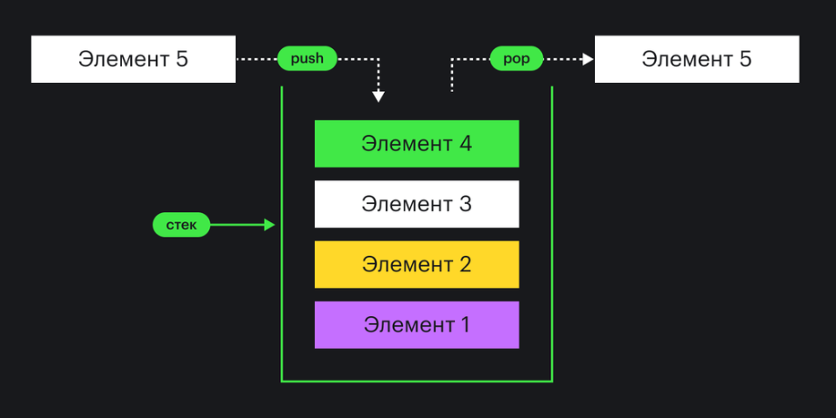

# Структура данных

Структура данных — это способ хранения данных в памяти и набор операций, которые она позволяет выполнять. Этот набор операций называется интерфейс. Различные стуктуры данных могут иметь одинаковые интерфейсы, но реализовывать их по-разному. Поэтому одинаковые операции для разных стуктур данных могут отличаться по вычислительной сложности.

## Стeк 

Стек — это структура данных, которая работает по принципу LIFO (Last In, First Out), что означает «последним пришёл — первым вышел».

